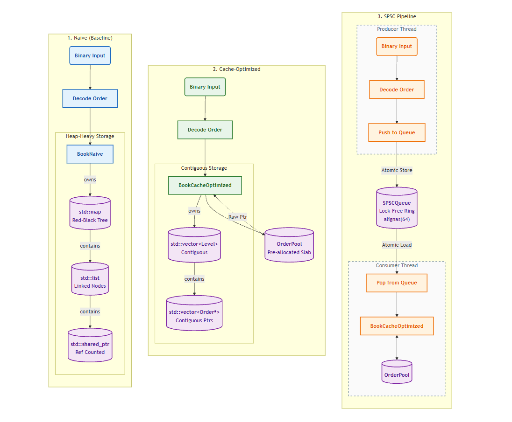

# Low-Latency C++ Limit Order Book

Compares a naive order book (`std::map` + `std::shared_ptr`) against a cache-optimized version to measure the real cost of pointer-chasing and heap allocations, running 100k binary-encoded orders.



| File | Description |
|------|------------|
| `BookNaive.h` | `std::map` + `std::list` + `std::shared_ptr` |
| `BookCacheOptimized.h` | Contiguous vectors, pre-allocated memory pool |
| `SPSCQueue.h` | Lock-free ring buffer for passing orders between threads |
| `BinaryProtocol.h` | 17-byte packed structs decoded with `memcpy`
| `OrderPool.h` | Memory pool to keep allocations off the hot path |
| `main.cpp` | Benchmark harness |


### Memory Pool Allocation

Pre-allocated contiguous array of `Order` objects with free index tracking for O(1) allocation/deallocation. The matching path avoids per-order heap allocation for `Order` objects

### Cache-Friendly Data Structures

Naive implementation uses pointer-heavy structures causing cache misses: `std::map` is a red-black tree with scattered node allocations, `std::list` is a doubly-linked list with poor spatial locality, and `std::shared_ptr` adds reference counting overhead on every access.

Cache-optimized implementation uses `std::vector<Level>` for contiguous price levels with sequential memory access, `std::vector<Order*>` to store orders at each level contiguously, and raw pointers to avoid reference counting overhead.

### Price and Time Priority

Standard price-time priority. Empty levels are marked inactive rather than erased to avoid shifting the vector. Each level has a head index that advances as orders fill, preserves FIFO order without removing elements.


### Lock-Free SPSC Queue

Simple lock-free ring buffer for inter-thread communication:
- Producer writes at `head`, consumer reads at `tail`
- Full when `(head + 1) % N == tail`, empty when `head == tail`
- `alignas(64)` separates head/tail to prevent false sharing
- All synchronization through atomic load/store

(Binary protocol) Fixed 17-byte packed messages `[id:8][price:4][quantity:4][side:1]`, encoded/decoded with `memcpy`

## Building and Running

### Prerequisites

- C++ Compiler: MSVC (Windows)

### Compilation

```cmd
cl /O2 /EHsc /std:c++17 /Fe:OrderBook.exe main.cpp
```

### Execution

```cmd
OrderBook.exe
```

Benchmark outputs:
1. Naive (map + list): Baseline throughput using standard library containers
2. Cache-Optimized (vector + pool): Single-threaded with memory pool and vectors
3. Cache-Optimized + SPSC Queue (2 threads): Multi-threaded pipeline with lock-free queue

## Benchmark Output

```
Order Book Benchmark (100000 orders)

Naive (map + list)
  11.4255 ms  |  8752352 orders/sec

Cache-Optimized (vector + pool)
  5.952 ms  |  16801075 orders/sec

Cache-Optimized + SPSC Queue (2 threads)
  8.0582 ms  |  12409719 orders/sec

Benchmark completed
```
